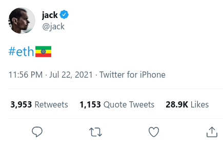
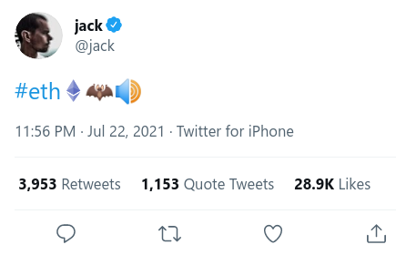
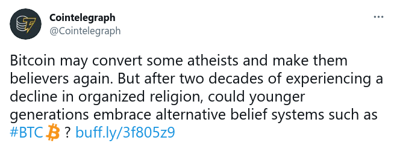
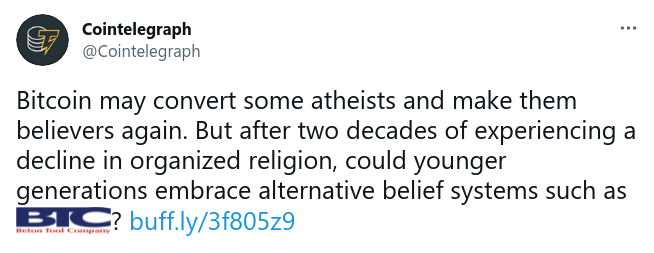

Etheriopia (browser userscript to fix Twitter)
==============================================

What's this for?
----------------

This browser userscript fixs a couple of critical bugs with Twitter's
website:

1. It doesn't render `#ETH` correctly.
2. It doesn't render `#BTC` correctly.

For example, this is obviously completely broken:

and here is the fixed version when this userscript is installed:

Similarly, this is wrong:

and here is the corrected version:

Background
----------

- https://en.cryptonomist.ch/2021/07/23/jack-dorsey-ethiopia-ethereum/
- https://twitter.com/jack/status/1418344349289566212
- https://twitter.com/coingecko/status/1418406317903863809?s=20
- http://podcast.banklesshq.com/rollup-uniswap-front-end-elizabeth-warren-shadowy-super-coders-covid-19-crypto-ftx-binance
- https://en.wikipedia.org/wiki/Ethiopia_at_the_Olympics

Installation
------------

First ensure you have [Tampermonkey](https://www.tampermonkey.net/) or
[Violentmonkey](https://violentmonkey.github.io/) installed.  This
script might also work with
[Greasemonkey](https://www.greasespot.net/), but I haven't tested that
yet.  (If you can help with that, please see [issue
#1](https://github.com/aspiers/etheriopia/issues/1).)

Then just [click
here](https://raw.githubusercontent.com/aspiers/etheriopia/master/etheriopia.user.js)
and it should offer you the option to install the userscript.

FAQ
---

### Can you fix my Android / iOS Twitter app too?

No, sorry there's no easy way to do that (but it probably is possible, at least).

Development / support / feedback
--------------------------------

Please see [the `CONTRIBUTING.md` file](CONTRIBUTING.md).

Copyright license
-----------------

See [the `COPYING` file](COPYING).
